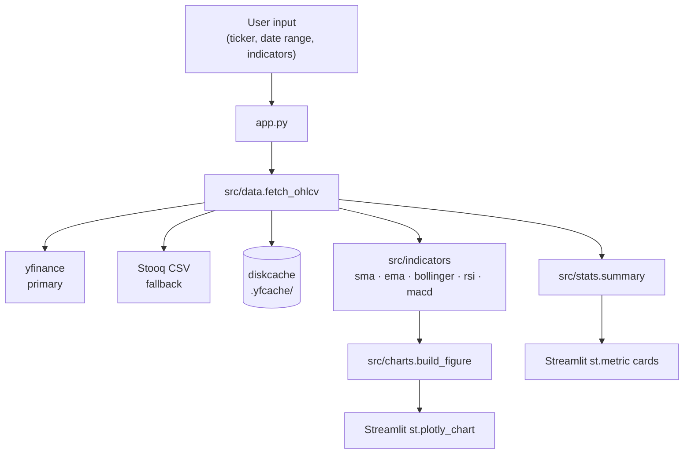

# Stock Dashboard — interactive technical analysis for any ticker

   [](https://github.com/FatihHekim0glu/stock-dashboard/actions/workflows/ci.yml)

> Hand-rolled technical indicators in pandas/numpy, verified against TA-Lib in CI. Plotly subplots, Streamlit UI, pytest with golden tests, GitHub Actions.

<!-- TODO: docs/demo.gif — 8–15 second screencap of the app in action.
     Record with ScreenToGif (https://www.screentogif.com/), aim for <5 MB, max 1280px wide,
     commit to docs/demo.gif and reference relatively below. -->

## Live demo

Deployment to Hugging Face Spaces is in progress. In the meantime, see [Quickstart](#quickstart) — runs locally in under a minute.

## What this does

Single-ticker stock dashboard with five hand-rolled technical indicators — SMA, EMA, Bollinger Bands, RSI, MACD — plus volume bars rendered directly from the OHLCV frame, summary statistics for any date range, and synchronized hover across price, volume, and indicator subplots. All indicator math is hand-implemented in pandas/numpy and unit-tested against TA-Lib.

## Why this project

- Practice writing numerical code that survives an oracle test (TA-Lib at `rtol=1e-6`), not just smoke tests.
- Build the full data-to-chart path end-to-end — fetch, retry, cache, compute, render — and own every layer.
- Learn where the footguns hide: Wilder smoothing vs `ewm(span)`, population vs sample standard deviation, Plotly subplot sync, yfinance rate-limit games.

## Quickstart

```bash
git clone https://github.com/FatihHekim0glu/stock-dashboard.git
cd stock-dashboard
pip install -r requirements.txt
streamlit run app.py
```

Or, with [uv](https://docs.astral.sh/uv/):

```bash
git clone https://github.com/FatihHekim0glu/stock-dashboard.git
cd stock-dashboard
uv sync
uv run streamlit run app.py
```

## How it works

The data path is intentionally short. A ticker symbol and date range from the sidebar are passed to `src/data.fetch_ohlcv`, which pulls daily bars from yfinance through a chrome-impersonating `curl_cffi` session (the plain `requests` user-agent gets rate-limited within a few calls). Results are memoised in a local `diskcache` keyed on `(ticker, start, end, trading_day_stamp)`, where the stamp rolls over at 21:00 UTC — after the US close but before the next session — so repeated queries inside a session never re-hit the network. When yfinance returns empty or throws (it does, surprisingly often), the wrapper falls back to the Stooq CSV endpoint and logs the swap so the user knows the source changed. The cleaned dataframe then feeds `src/indicators` for the five computed technical series and `src/stats` for the summary metrics; volume bars are drawn straight from the OHLCV frame without an indicator pass. All three streams hand off to `src/charts.build_figure` to assemble one Plotly figure with synchronized x-axes across the price, indicator, and volume subplots, which Streamlit renders via `st.plotly_chart`.

Every indicator is implemented from scratch in pandas and numpy — no `ta`, no `pandas-ta`, no `finta`. Correctness is enforced in CI against TA-Lib as an oracle on the same input series, with closed-form tests on degenerate inputs (a constant series gives a Bollinger bandwidth of exactly zero and an RSI of NaN — both average gain and loss are zero, so RS is 0/0; a monotone increasing series gives an RSI of 100). One golden test pins the 14-day RSI for the IBM closing prices in Wilder's 1978 *New Concepts in Technical Trading Systems* to the value printed in the book, which catches the most common reimplementation mistake — using `ewm(span=n)` instead of Wilder's `alpha = 1/n` smoothing, a bug that produces values close enough to look right but wrong by 2–4 points at the extremes.



## Project structure

```
stock-dashboard/
├── app.py              Streamlit entry point
├── src/
│   ├── data.py         yfinance wrapper with Stooq fallback + disk cache
│   ├── indicators.py   SMA, EMA, Bollinger, RSI, MACD (hand-rolled)
│   ├── stats.py        CAGR, volatility, Sharpe, max drawdown
│   └── charts.py       Plotly multi-subplot builder
└── tests/              pytest suite + TA-Lib oracle tests
```

## Indicators implemented

All implementations are hand-rolled in pandas/numpy and verified against TA-Lib in tests.

| Indicator       | Period(s)    | Notes                                                         |
| --------------- | ------------ | ------------------------------------------------------------- |
| SMA             | 20, 50       | Plain rolling mean, `min_periods=length`                      |
| EMA             | 12, 26       | SMA-seeded, `adjust=False`                                    |
| Bollinger Bands | 20, k = 2    | Population std (`ddof=0`) to match TA-Lib and Bollinger's original definition |
| RSI             | 14           | Wilder's RMA smoothing (`alpha = 1/n`), not `ewm(span=n)`     |
| MACD            | 12 / 26 / 9  | Line, signal, histogram                                       |
| Volume          | —            | Bars coloured by daily direction                              |

## Summary statistics

For any user-selected date range, the panel shows:

- Cumulative return and annualised return (geometric CAGR, 252-day base)
- Annualised volatility (sample std, × √252)
- Sharpe ratio (rf = 0 by default, explicitly labelled in the UI)
- Maximum drawdown (computed on the total-return equity curve, not raw prices)
- Best and worst day, trading-day count

## Tests

```bash
pip install -r requirements-dev.txt
pytest                    # full suite
pytest -m "not slow"      # skip network / oracle tests
```

The TA-Lib oracle tests are gated by `pytest.importorskip("talib")` and skip silently on machines without TA-Lib installed.

## Roadmap and limitations

- Single-ticker only — multi-ticker comparison is deliberately out of scope for v1.
- Daily bars only; no real-time or intraday data.
- No persistence of user preferences between sessions.
- Stooq fallback does not provide dividend-adjusted prices; falling back to it is logged so the user knows.

## License

MIT — see [LICENSE](LICENSE).
